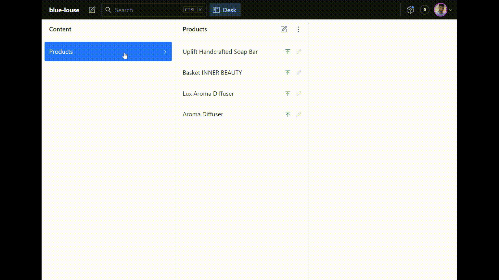

# 🧠🛒 Memoryzen (e-commerce)

Fully responsive ecommerce SSR app with cart, payment and content management implemented (CMS).

See a live demo here: [https://memoryzen-luisggc.vercel.app/](https://memoryzen-luisggc.vercel.app/).

## 🎯 Features

- SSR with NextJS;
- State management with React Context
- Payment with Stripe API
- Content Management with Sanity (ADM Panel)
- Styling with TailWindCSS

## 📌 Screenshots

- HomePage

- Product Page + Cart

- Payment

- CMS

